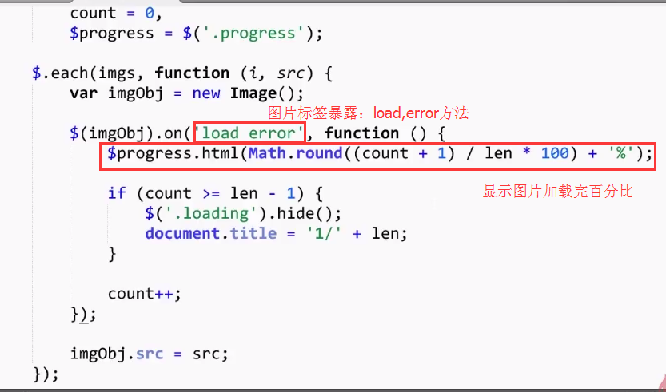
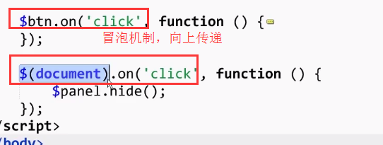

2018-03-18

@(mk)

学习参考：
[慕课-图片预加载](https://www.imooc.com/learn/502)

学习笔记：

## 无序加载 - 百分比显示图片加载进度
知识点：
1. var imgObj = new Image();
image标签有两个事件:
正常加载完触发：load
错误触发：error
2. jquery提供的公共方法定义调用方式：


1- **简单编写实现初始化显示：百分比图片加载进度**


2- **插件编写方式**
知识点：
1- 预加载插件编写：
局部作用域，防止冲突


```
(function($){ 
	function PreLoad(imgs,options){
		this.imgs = (typeof imgs === 'string') ? [imgs] : imgs;
		this.opts = $.extend({},PreLoad.DEFAULTS,options);
		
	this._unordered()	
   }
   PreLoad.DEFAULTS = {
	   each:null,//每一张图片加载完毕后执行
	   all:null,//所有图片加载完毕后执行
	}
	PreLoad.prototype._unordered = function(){//无需加载
		var imgs = this.imgs,
			  opts = this.opts,
			  count = 0,
			  len = imgs.length;
		}
		$.each(imgs,function(i,src){
			if(typeof src != 'string') return;
			var imgObj = new Image()
			$(imgObj).on('load error',function(){
				$progress.html(Math.round((count + 1) / len * 100) + '%');
					opts.each && opts.each(count);// 判断是否为数组，是则执行方法
					if( count >= len-1){
							opts.all && opts.all();//判断有无全部图片全部加载后方法，有则执行
				    }
				    imgObj.src  = src
		})
	  })
		$.extend({
			preload:function(imgs,opts){
				new PreLoad(imgs,opts);
			},
			all:function(){
				$.
			}
		})
   })(jQuery);
```
引用插件：
```
var index = 0,
	len = imgs.length,
	$progress = $('.progress');
	$.preload(imgs,{
		each:function(count){
			$progress.html(Math.round((count + 1)/len * 100) + '%')},
		all:function(){
			$progress.hide()
			document.title = '1/'+len;
		}
	})
```


## 无序加载 - 文字提示

知识点：
1- 时间冒泡

解决方式：禁止事件冒泡 e.stopPropagation()

页面html:


```
$btn.on('click',function(e){
	e.stopPropagation()
	$panel.show()
	$.preload(imgs,{
		all:function(){
			var html = '';
			html += '<ul class="list">';
			for (var i =0 ;i<len;i++){
				html += '<li>'
			$panel.html(html)
		},
		
	})
})
```

## 有序加载 - 漫画图片加载方式
知识点：
1. 顺序加载方式

1- 基本html:


2- 给插件添加无需有序标签，对方法封装


## 完整插件代码
```
(function($) {
  function PreLoad(imgs, options) {
    this.imgs = (typeof imgs === 'string') ? [imgs] : imgs;
    this.opts = $.extend({}, PreLoad.DEFAULTS, options);

    if (this.opts.order === "ordered") {
      this._ordered()
    } else {
      this._unordered();
    }
  }
  PreLoad.DEFAULTS = {
    order: 'unordered', //无序预加载
    each: null, //每张图片加载完毕后执行
    all: null //所有图片加载完后执行
  };
  PreLoad.prototype._unordered = function(){   //无序加载
    var imgs = this.imgs,
        opts = this.opts,
        count = 0,
        len = imgs.length;
    $.each(imgs, function(i, src) {
      if (typeof src != 'string') {
        return;
      }
      var imgObj = new Image();
      $(imgObj).on('load error', function() {
        opts.each && opts.each(count);
        if (count >= len - 1) {
          opts.all && opts.all();
        }
        count++;
      });
      imgObj.src = src;
    });
  };
  PreLoad.prototype._ordered = function() {
    var opts = this.opts,
        imgs = this.imgs,
        len = imgs.length,
        count = 0;

        load();

        function load() {
          var imgObj = new Image();
          $(imgObj).on('load error', function() {
              opts.each && opts.each(count);
              if (count >= len) {
                //所有图片已经加载完毕
                opts.all && opts.all();
              } else {
                load();
              }
              count++;
          });
          imgObj.src = imgs[count];
        }
  }
  $.extend({
    preload: function(imgs, opts) {
      new PreLoad(imgs, opts);
    }
  });
})(jQuery);

```

## 总结
实现方法：
1- 实例化Image对象
2- 监听load,error事件
3- 为src附上路径